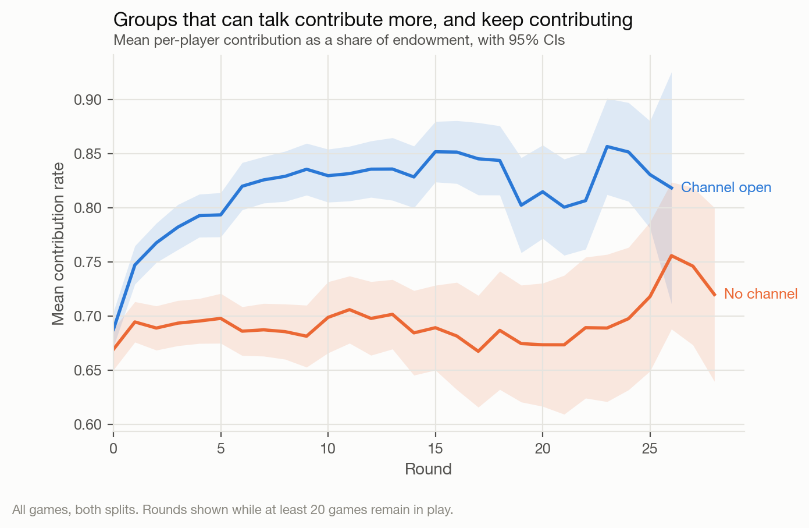
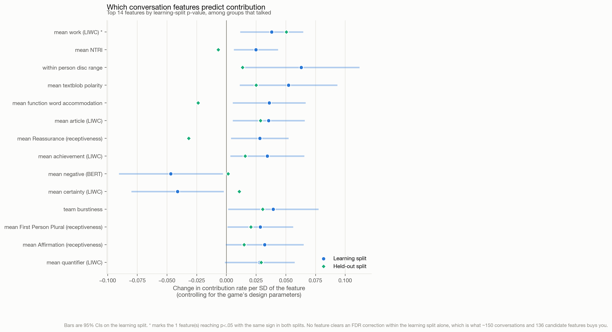
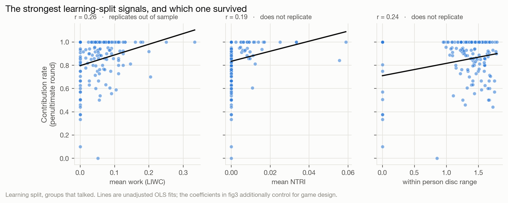
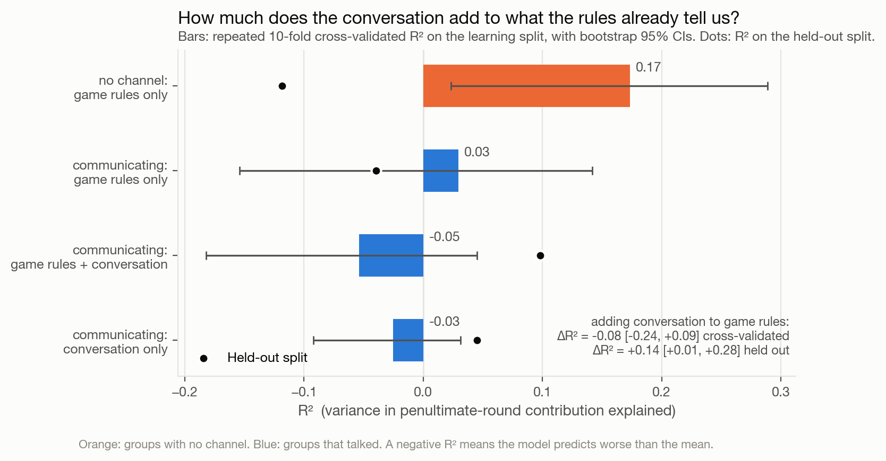

# What do groups say that makes them cooperate?

### A case study for the [Team Communication Toolkit](https://github.com/Watts-Lab/team_comm_tools)

This repository is a worked example of using the Team Communication Toolkit
(`team_comm_tools`, v0.1.8) end to end: from raw conversation logs, to 100+
extracted conversation features, to an answer to a substantive research question.

It is deliberately small. The point is not the sophistication of the analysis but
the shape of the workflow — how little work it takes to get from a four-column
chat table to a set of plausible signals worth testing.

---

## The research question

> **Which conversation features predict greater contribution in groups that
> communicate, versus groups that do not?**

The setting is an online **public goods game**. Groups of players repeatedly choose
how much of a private endowment to put into a shared pot; the pot is multiplied and
split evenly regardless of who paid in. Contributing is good for the group and
costly for the individual, so contribution rates are a clean behavioral measure of
cooperation.

Crucially, the experiment randomized **whether a group had a chat channel at all**.
That gives the question two halves, and the second is what the toolkit is for:

| | Question | What it establishes |
|---|---|---|
| **A. The channel** | Do groups that *can* talk contribute more than groups that cannot? | The well-documented "communication effect" — replicated here as a sanity check. |
| **B. The content** | Among groups that *did* talk, what about the conversation predicts contribution? | Whether the effect is about the channel existing, or about what gets said in it. |
| **C. The value added** | Does conversation buy predictive power the game's own design parameters do not already provide? | Whether these features are worth extracting at all. |

Groups without a channel are not a nuisance category to drop — they are the
counterfactual. They tell us how much of a group's cooperation is predictable from
the rules of the game alone, which is the bar that conversation features have to clear.

## Design

* **Unit of analysis:** one game (one group, one conversation).
* **Outcome:** the group's mean contribution rate in the **penultimate round**.
  The last round is avoided because groups that know the game is ending defect
  almost mechanically, which says more about the horizon than about the group.
* **Controls:** the game's randomized design parameters (group size, multiplier,
  number of rounds, punishment and reward rules, and so on). These are known before
  anyone speaks, so conversation features have to add power on top of them.
* **Predictor window:** only messages sent *before* the outcome is decided — every
  round prior to the penultimate one, plus the penultimate round's own
  contribution-phase chat. Later messages would leak the result.
* **Validation:** every modeling decision — which features survive screening, which
  model form, which hyperparameters — is made on the **learning split** alone. The
  **held-out split** is touched exactly once, at the end, to check that the findings
  survive contact with data they did not shape.

## Repository layout

```
.
├── data/
│   ├── raw/           # the two experiment pickles, as collected
│   └── processed/     # tidy CSVs written by step 1 and step 3
├── scripts/
│   ├── config.py                 # paths and constants, imported everywhere
│   ├── style.py                  # shared figure styling
│   ├── compat/pgg_helper/        # stub module so the raw pickles unpickle
│   ├── 01_prepare_data.py        # raw pickles  -> chat + game tables
│   ├── 02_extract_features.py    # chat table   -> toolkit features
│   ├── 03_build_analysis_table.py# features     -> one row per game
│   ├── 04_analysis.py            # the three questions above
│   ├── 05_figures.py             # the four figures
│   └── run_all.py                # all of the above, in order
└── outputs/
    ├── features/      # toolkit output at chat, speaker, conversation level
    ├── tables/        # analysis results as CSV
    └── figures/       # the figures reported below
```

## Running it

```bash
pip install -r requirements.txt
python scripts/run_all.py
```

Step 2 is the slow one: it runs sentence embeddings and several classifiers over
~23,000 messages, and takes on the order of an hour on a laptop CPU. Its outputs are
cached, so re-running it is a no-op unless you pass `--force`. Step 4 takes a few
minutes (the penalized models are refit inside every cross-validation fold, three
times over). Every script also runs standalone.

## Using the toolkit

The entire feature-extraction step is one call. This is the part worth copying:

```python
from team_comm_tools import FeatureBuilder

FeatureBuilder(
    input_df=chat,                 # one row per message
    conversation_id_col="gameId",  # what counts as one conversation
    speaker_id_col="playerId",
    message_col="text",
    timestamp_col="timestamp",
    output_file_path_chat_level="outputs/features/learn_chat_level.csv",
    output_file_path_user_level="outputs/features/learn_user_level.csv",
    output_file_path_conv_level="outputs/features/learn_conv_level.csv",
    custom_features=["(BERT) Mimicry", "Moving Mimicry",
                     "Forward Flow", "Discursive Diversity"],
).featurize()
```

Four columns in; three levels of analysis out. The conversation-level file is the
one this case study models, since the question is about groups rather than about
individual messages.

## Findings

_Every number below is produced by `scripts/04_analysis.py`; the full tables are in `outputs/tables/`._

### A. The channel matters, and it matters a lot

| Split | No channel | Channel open | Adjusted difference | p |
|---|---|---|---|---|
| Learning (357 games) | 0.658 | 0.808 | **+0.152** [0.104, 0.200] | <.001 |
| Held-out (446 games) | 0.681 | 0.800 | **+0.128** [0.031, 0.224] | .009 |

Contribution rates are shares of the per-round endowment; the adjusted difference
controls for every design parameter. Groups that can talk contribute about 13-15
percentage points more, and the gap opens in the first few rounds and never closes
(fig1). This is the communication effect the literature reports, reproduced here as
a sanity check on the data.



### B. Among groups that talked, one signal survives contact with new data

136 conversation features went into the screen. **None clears an FDR correction
within the learning split** - with ~150 conversations that screen has very little
power. One feature reaches p<.05 with the same sign in both splits:

| Feature | Learning split | Held-out split |
|---|---|---|
| `mean_work_lexical_wordcount` (LIWC "work" words) | +0.038 per SD, p=.005 | +0.050 per SD, p=.001 |

Groups whose talk is more task-focused - words about the job at hand rather than
about anything else - contribute more, holding the game's design fixed. The next
strongest learning-split signals (a repair-initiation measure, within-person
discursive range, sentiment polarity) do not survive the held-out check, which is
exactly the failure mode a single-split analysis would have missed.





### C. Whether conversation adds predictive power is unresolved

| Model | CV R² (learn) | R² (held out) |
|---|---|---|
| No channel: game rules only | 0.173 [0.023, 0.289] | -0.118 |
| Communicating: game rules only | 0.030 [-0.154, 0.142] | -0.039 |
| Communicating: game rules + conversation | -0.054 [-0.182, 0.045] | 0.098 |
| Communicating: conversation only | -0.025 [-0.092, 0.031] | 0.045 |

Adding conversation to the game rules, among groups that talked:

* cross-validated **ΔR² = -0.08** [-0.24, +0.09]
* held-out **ΔR² = +0.14** [+0.01, +0.28]

These two estimates point in opposite directions, and the honest summary is that
they do not settle the question. The cross-validated estimate says the extra
features cost more in variance than they return; the held-out estimate says they
return something real. With 147 conversations to learn from, both intervals are
wide enough to contain the other's point estimate.



One side result is worth noting. The game's design parameters predict contribution
well for groups that **cannot** talk (CV R² 0.17) and barely at all for groups that
**can** (0.03). Once a group has a channel, the rules of the game explain much less
of what it does - which is what you would expect if the conversation, rather than
the incentives, is doing the work. The toolkit's features do not yet recover that
missing variance.

### What the case study demonstrates about the toolkit

The point of the exercise is the ratio: **one function call and about an hour of
CPU** turned 23,000 raw messages into a feature matrix that supported all three
analyses above. The screen was broad, cheap, and mostly negative - which is the
normal outcome of an honest exploratory pass, and the reason a tool that makes such
passes cheap is worth having. The one signal that survived (task-focused talk) is a
hypothesis to design a study around, not a result to report as established.

## A note on what this does and does not show

These features are **exploratory signals, not validated constructs**. The toolkit
guarantees that each column computes what its documentation says it computes; it
cannot guarantee that a column measures the construct a given researcher has in
mind. The workflow here — screen broadly, control for what you know, then check
against held-out data — is the appropriate way to treat that kind of output. A
feature that survives it is a hypothesis worth following up, not a finding.
