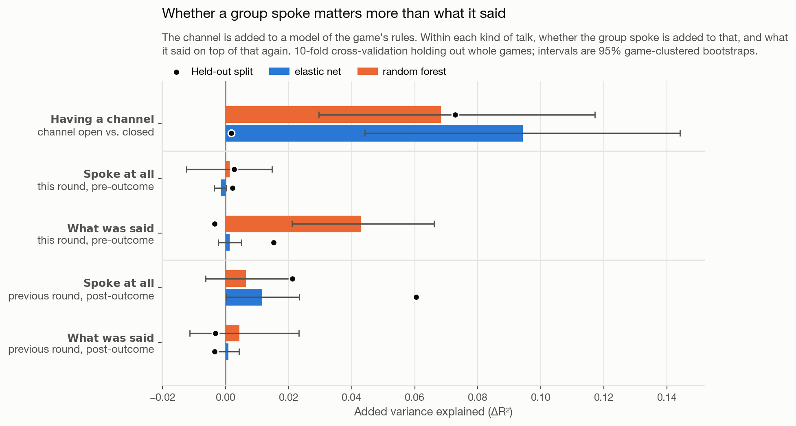
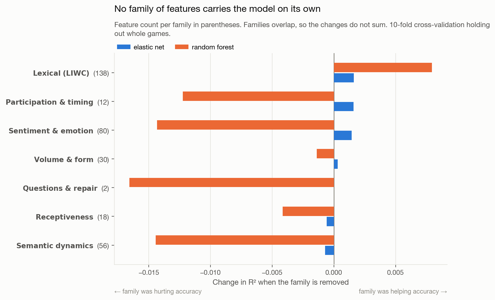
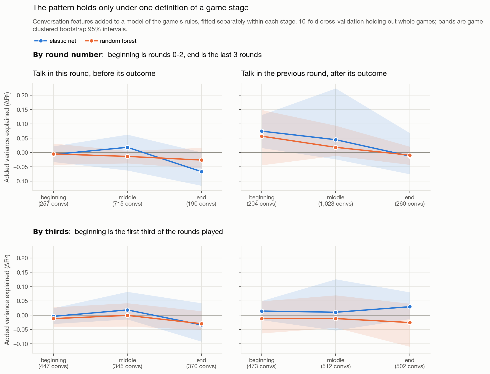
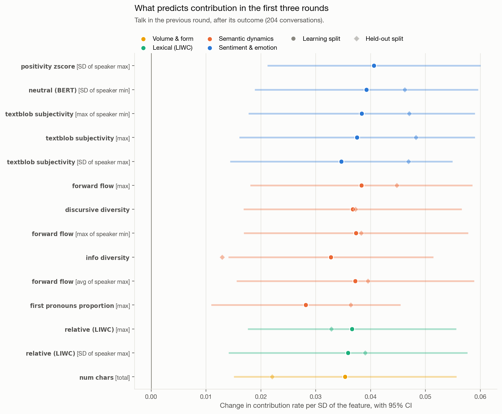
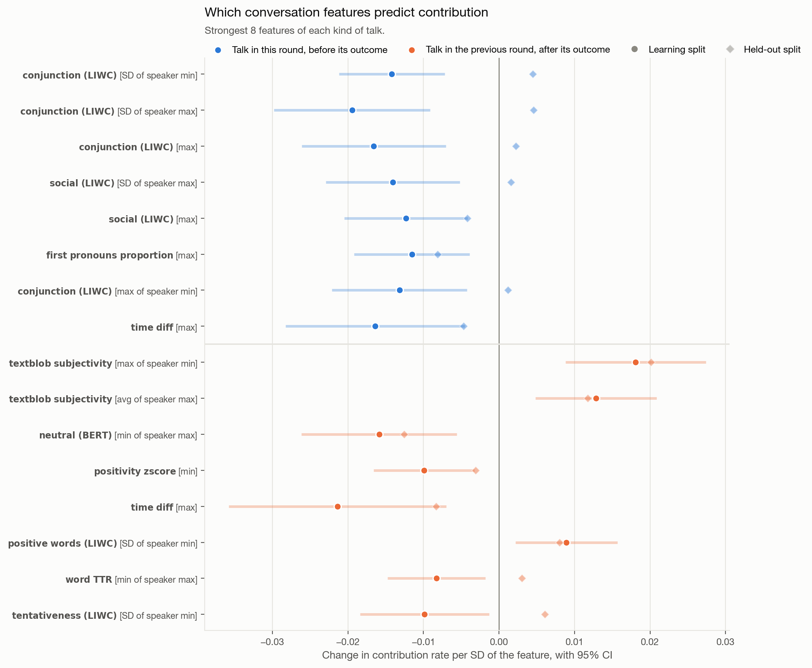
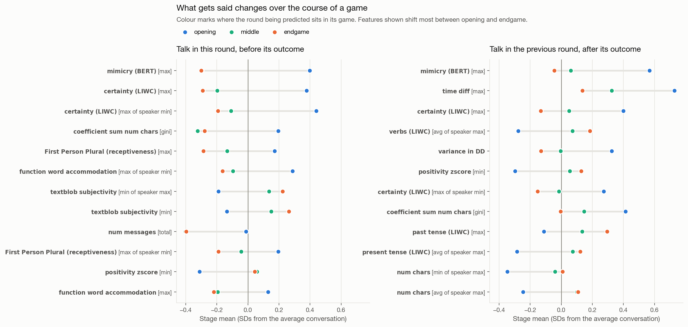
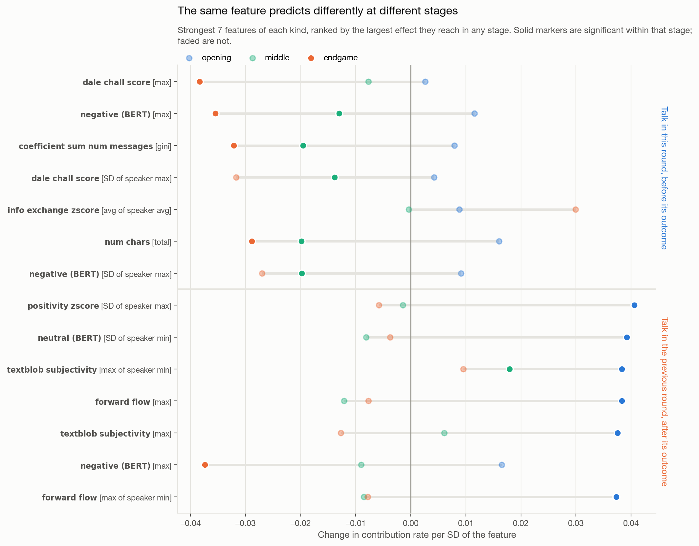

# What do groups say that makes them cooperate?

### A case study for the [Team Communication Toolkit](https://github.com/Watts-Lab/team_comm_tools)

This repository is a worked example of using the Team Communication Toolkit
(`team_comm_tools`, v0.1.8) end to end: from raw conversation logs, to 100+
extracted conversation features, to an answer to a substantive research question.

It is deliberately small. The point is not the sophistication of the analysis but
the shape of the workflow — how little work it takes to get from a four-column
chat table to a set of plausible signals worth testing.

---

## The research question

> **Which conversation features predict greater contribution in groups that
> communicate, versus groups that do not?**

The setting is an online **public goods game**. Groups repeatedly choose how much of
a private endowment to put into a shared pot; the pot is multiplied and split evenly
regardless of who paid in. Contributing is good for the group and costly for the
individual, so contribution rate is a clean behavioral measure of cooperation.

The experiment randomized **whether a group had a chat channel at all**, alongside
every other rule of the game. That turns a vague question into a decomposition:

| Term | What it is |
|---|---|
| **Rules & timing** | group size, multiplier, punishment and reward rules, how far into the game the round sits |
| **Channel** | whether the group could talk at all |
| **Spoke at all** | whether a group with a channel actually used it, in a given round |
| **Content** | 168 toolkit features describing what was said |

Groups without a channel are not a nuisance category — they are the counterfactual
that separates the channel from the content.

## Design

* **Unit of analysis:** a **game-round** — one group, one round of play. 5,765 in the
  learning split, 6,692 held out. There are only a few hundred games, and that is
  what makes the game-round the workable unit.
* **Outcome:** the group's mean contribution in a round, as a share of endowment.
* **Two kinds of talk**, both predicting the *same* round's contribution but drawn
  from different moments:

  | Block | Source | Learning-split conversations |
  |---|---|---|
  | **Before the outcome** | that round's own contribution phase | 1,162 |
  | **After the outcome** | the **previous** round's outcome and summary phases | 1,487 |

  Every message is therefore spoken before the decision it is used to predict. The
  first block is contemporaneous with that decision rather than strictly prior to
  it — a player may type after having already locked in a contribution — but it
  cannot contain information about the outcome, which is not revealed until the
  phase ends. The second block carries no such caveat.
* **Two ways of locating a round in its game**, because games run from 3 to 30
  rounds and the two disagree:

  | Scheme | Definition |
  |---|---|
  | **By round number** (primary) | beginning = rounds 0–2, end = last 3 rounds, middle = the rest |
  | **By thirds** | each stage is one third of the rounds played |

  Under thirds, "beginning" means rounds 0–1 in a short game and rounds 0–9 in a long
  one. Reporting both is not ceremony: the main timing result appears under one and
  not the other.
* **Three states of silence, encoded separately.** A round with no channel *could
  not* talk; a round with a channel where nobody spoke *chose not to*; the second is
  a behavior, and it is the largest of the three groups (1,751 of 5,765 for the
  before-outcome block). No-channel rounds get neutral feature values as the
  counterfactual; chosen silence is flagged by its own indicator and gets a truthful
  zero on the two features that are genuine counts. The other 166 features are
  per-message means and conversation-level ratios, which are *undefined* without a
  conversation rather than zero.
* **Games are held out whole.** Rounds within a game share a group, a treatment and
  often a conversation, so cross-validation folds split on `gameId` and every
  interval comes from a game-clustered bootstrap.
* **Two model families**, both with hyperparameters tuned *inside* each training
  fold: `ElasticNetCV` and a `RandomForestRegressor`. Nesting matters here — tuning
  the forest once on the same folds whose R² is then reported inflated it by 0.038,
  more than the largest content effect in the study.
* **Validation:** feature selection, scaling, model form and hyperparameters are all
  decided on the learning split. The held-out split is scored once.

## What counts as a conversation, and how features are aggregated

The toolkit computes each feature **at the utterance level** — one value per
message — and then aggregates upward. What "upward" means depends on what you tell
it a conversation is, so that choice does most of the work.

**Here, one conversation is one game-round *and* one block.** A conversation id is
`{gameId}_r{round}_{pre|post}`, so a single game contributes many conversations
rather than one:

| | Learning split |
|---|---|
| Games that talked | 148 |
| Conversations | 2,649 |
| Conversations per game | median 14, max 56 |
| Messages per conversation | median 3 |

A 30-round game yields close to sixty conversations, not thirty: up to one
before-outcome conversation per round, plus one after-outcome conversation per round
that has a successor. This is why the conversations are short — a median of three
messages — and why conversation-level features like discursive diversity are noisier
here than they would be over a whole game.

Which messages land in which conversation:

| Block | Messages | Predicts |
|---|---|---|
| `{game}_r{t}_pre` | round *t*'s contribution-phase chat | round *t*'s contribution |
| `{game}_r{t}_post` | round *t*'s outcome- and summary-phase chat | round *t+1*'s contribution |

So round *t*'s messages are split across two different conversations depending on
whether they were sent before or after that round's result appeared, and those two
conversations are featurized independently and predict different rounds. Nothing is
double-counted, and nothing is discarded except messages with no round to predict:
round 0's pre-outcome chat (there is no round before it to supply a POST block, and
the analysis needs both) and the final round's post-outcome chat.

The 248 surviving columns reach the conversation level three different ways:

| Route | Columns | Example |
|---|---|---|
| **Native conversation-level** | 16 | `turn_taking_index`, `team_burstiness`, `discursive_diversity` — computed from the conversation as a whole, never aggregated from parts |
| **Utterance → conversation** | 91 | `max_forward_flow` — the largest value across the messages in the conversation |
| **Utterance → speaker → conversation** | 137 | `mean_user_max_positivity_zscore_chats` — each speaker's maximum across their own messages, then averaged across speakers |

The two-stage columns are the ones with awkward names, and the extra stage matters:
`mean_user_max_X` and `max_X` answer different questions — "how high does a typical
participant get" versus "how high does anyone get" — and a three-person conversation
can move them in opposite directions. Figures spell the route out in brackets after
the feature name, so `certainty (LIWC) [max of speaker min]` reads as the
conversation maximum, across speakers, of each speaker's minimum.

## How the nested models are built

Each ΔR² in the decomposition is the gain from adding one block of columns to a
model that already contains everything above it *in its own group*:

```
M0   game rules + round timing
M1   M0 + chat channel indicator                    -> ΔR² for the channel

     within the before-outcome block:
M2a  M1 + did this group speak this round           -> ΔR² for speaking
M3a  M2a + 168 features describing what was said    -> ΔR² for content

     within the after-outcome block:
M2b  M1 + did this group speak last round           -> ΔR² for speaking
M3b  M2b + 168 features describing what was said    -> ΔR² for content
```

The two talk blocks branch from the same point (M1) rather than chaining into each
other, so neither gets an advantage from being entered first. Content is always
measured *after* the speech indicators, which is what makes "what was said" mean
what it says: any gain it shows is over and above knowing whether the group spoke.

Every R² is out-of-fold, from 10-fold cross-validation with whole games held out, and
every interval is a 95% percentile bootstrap resampling games rather than rows.
Model hyperparameters are retuned inside each training fold.

## Feature extraction

The toolkit's own redundancy reduction does the feature selection, new in v0.1.8:

```python
FeatureBuilder(
    input_df=chat,
    conversation_id_col="conv_id",   # one conversation = one game-round-and-block
    speaker_id_col="playerId",
    message_col="text",
    timestamp_col="timestamp",
    custom_features=["(BERT) Mimicry", "Moving Mimicry",
                     "Forward Flow", "Discursive Diversity"],
    drop_redundant_columns=True,
    corr_thresh=0.9,
    treat_zero_as_na=False,
).featurize()
```

That took **3,083 columns to 248**, by finding 188 groups of features correlated
above 0.9 and keeping one representative each. The groups are informative in their
own right — ConvoKit politeness and Yeomans receptiveness measure much the same
thing here, and after reduction **not one politeness column survives**; every one was
absorbed into a group represented by a receptiveness or LIWC feature. Receptiveness
itself fell from 34 columns to 9.

One setting is deliberately not the default. `treat_zero_as_na=True` is better for
*estimating* correlations between sparse features, but the frame it modifies is the
one written to disk, so it also rewrites every zero in the output as NA — on a
60-conversation sample, 7,642 zeros became 20,745 NAs. Here zero is data ("this
conversation contained no greetings"), and the analysis reads NA as "no conversation
happened".

## Repository layout

```
.
├── data/
│   ├── raw/           # the two experiment pickles, as collected
│   └── processed/     # tidy CSVs written by steps 1 and 3
├── scripts/
│   ├── config.py                  # paths, controls, feature families
│   ├── style.py                   # figure rules and shared styling
│   ├── status.sh                  # pipeline tracker; -w to watch
│   ├── compat/pgg_helper/         # stub module so the raw pickles unpickle
│   ├── 01_prepare_data.py         # pickles      -> chat + game-round tables
│   ├── 02_extract_features.py     # chat table   -> toolkit features
│   ├── 03_build_analysis_table.py # features     -> one row per game-round
│   ├── 04_analysis.py             # every result reported below
│   ├── 05_figures.py              # the eight figures
│   └── run_all.py                 # all of the above, in order
└── outputs/
    ├── features/      # toolkit output at chat, speaker, conversation level
    ├── tables/        # analysis results as CSV
    └── figures/       # the figures reported below
```

## Running it

```bash
pip install -r requirements.txt
python scripts/run_all.py          # end to end
bash scripts/status.sh -w          # watch progress in another terminal
```

Step 2 is the slow one: sentence embeddings and several classifiers over ~23,000
messages, on the order of an hour on a laptop CPU. Its outputs are cached, so
re-running is a no-op unless you pass `--force`. Step 4 takes roughly 20 minutes,
since both model families are retuned inside every cross-validation fold. Every
script also runs standalone.

`scripts/status.sh` reports a stage as current only when its outputs postdate both
the data they were computed from *and* the script that computed them, and prints a
red `!` otherwise. That is worth having: several results in earlier drafts of this
analysis were read off tables that a later change had already invalidated.

## Findings

_Every number below comes from `scripts/04_analysis.py`; full tables are in
`outputs/tables/`. Track a run with `bash scripts/status.sh -w`._

### 1. Groups that can talk contribute more

| Split | No channel | Channel open | Adjusted difference | p |
|---|---|---|---|---|
| Learning (5,765 game-rounds, 357 games) | 0.682 | 0.816 | **+0.143** [0.102, 0.184] | <.001 |
| Held out (6,692 game-rounds, 446 games) | 0.700 | 0.797 | **+0.063** [−0.008, 0.134] | .080 |

Errors clustered by game. The effect replicates in direction but is less than half
the size and only marginally significant out of sample. That gap survived four
redesigns, so it is a property of the data rather than of a modeling choice: the
held-out split simply talks less, with 2,788 of its channel-open rounds silent
against 1,751 in the learning split.


### 2. Whether a group spoke matters more than what it said

Cross-validated ΔR², each term added to the one before it:

| Term | Elastic net | Random forest |
|---|---|---|
| Having a channel | **+0.094** [0.044, 0.144] | **+0.068** [0.030, 0.117] |
| Spoke at all — this round, pre-outcome | −0.002 | +0.001 |
| What was said — this round, pre-outcome | +0.001 | +0.043 [0.021, 0.066] |
| Spoke at all — previous round, post-outcome | **+0.012** [0.000, 0.023] | +0.006 |
| What was said — previous round, post-outcome | +0.001 | +0.004 |



Two things to read off this. The channel is worth five to ten times any talk term.
And the one talk term that reaches significance under the honest linear model —
previous-round speech, +0.012, held-out **+0.060** — is the *binary* one: whether
the group said anything at all, not what it contained. Separating those two was
what kept the study from reporting a content effect that is really a silence effect.

The forest's +0.043 for pre-outcome content is the clearest overfit in the study:
strong in cross-validation, **−0.004** on held-out data.

### 3. No family of features carries the model

Removing each toolkit family in turn changes cross-validated R² by at most 0.008,
and for the forest most families are negative — removing them *helps*. After
redundancy reduction the families no longer overlap, so this is a cleaner null than
it would have been on the raw output.



### 4. Talk predicts contribution only at the very start, and only by one definition

| Stage | Elastic net (held out) | Random forest (held out) |
|---|---|---|
| **Beginning** (rounds 0–2) | **+0.074** [0.016, 0.131] (**+0.070**) | +0.057 [−0.045, 0.149] (**+0.072**) |
| Middle | +0.045 (+0.001) | +0.018 (+0.001) |
| End (last 3 rounds) | −0.013 (+0.002) | −0.009 (−0.016) |

This is previous-round talk, among rounds that actually had it. Both model families
agree and both replicate out of sample — the only place in the study where that
happens.

It also **disappears under the other staging definition**. Grouped into thirds of the
game rather than by round number, the same analysis returns +0.014 and −0.012. The
effect belongs to the literal opening rounds, not to the first third of a game, and
a single staging scheme would have hidden that.



### 5. Inside that one cell

Restricted to the 204 conversations that follow an opening round, **61 of 168
features reach p<0.05** — against roughly 8 expected by chance — and **24 survive
FDR correction**. The leaders replicate on held-out data at p<0.001, and they group
coherently rather than scattering:

| Family | Leading features |
|---|---|
| Sentiment & emotion | positivity z-score, textblob subjectivity, neutral BERT |
| Semantic dynamics | forward flow, discursive diversity, info diversity |
| Lexical (LIWC) | relativity words |

All positive. Groups whose post-outcome talk in the opening rounds ranges more
widely and carries more subjective, positive content contribute more in the next
round.



### 6. Pooled across the game, almost nothing survives

Across all rounds, 336 feature-by-block tests yield **5 clearing FDR and 1 replicating**.



### 7. What gets said changes, and so does what it predicts

Opening deliberation runs 0.4–0.45 SD above average on mimicry and certainty
language, while message volume, participation inequality and later-stage talk sit
flat. The sampled messages match: opening talk is explicit coordination on a number
("Okay, 20 it is", "yeah i agree, the multiplier is so big"), while later rounds are
"yes", "max", "It's cool lol".



More strikingly, the features that predict at the beginning are **not** the ones that
predict later. Correlations between stages' full coefficient vectors:

| Comparison | Correlation | Significant in both, same sign |
|---|---|---|
| Pre-outcome: beginning ↔ middle | **−0.42** | **0** of 16 and 52 |
| Pre-outcome: beginning ↔ end | 0.00 | 0 |
| Post-outcome: beginning ↔ end | −0.35 | 0 |
| Post-outcome: middle ↔ end | +0.52 | 4 |

Deliberation features that predict contribution at the beginning predict it in the
*opposite* direction mid-game. The later stages resemble each other; neither
resembles the opening.



### What the case study demonstrates about the toolkit

The extraction is cheap: one `FeatureBuilder` call turned ~23,000 messages into 168
non-redundant features at a grain — game-round × before/after outcome — chosen after
the fact by changing one argument. The toolkit's redundancy reduction then did the
feature selection better than the hand-rolled screen it replaced, and told us
something substantive on the way: politeness and receptiveness are not separate
measurements in this dataset.

The results are mostly null, and the nulls are the point. A broad screen over 168
features found no family carrying unique variance, almost nothing surviving both a
multiplicity correction and a held-out test, and a content term that mostly turns
out to be a silence term. One real signal survived: what a group says right after
its first outcome.

Getting there required corrections that each changed the answer — clustering folds
by game, nesting the forest's tuning, separating "spoke" from "said", encoding two
kinds of silence differently, standardizing coefficients within subsample, and
guarding against zero-variance regressions. **Cheap features do not make a cheap
study**, and every one of those failure modes was easier to walk into *because* the
features were cheap.

## A note on what this does and does not show

These features are **exploratory signals, not validated constructs**. The toolkit
guarantees that each column computes what its documentation says it computes; it
cannot guarantee that a column measures the construct a given researcher has in
mind. The workflow here — screen broadly, control for what you know, then check
against held-out data — is the appropriate way to treat that kind of output. A
feature that survives it is a hypothesis worth following up, not a finding.
