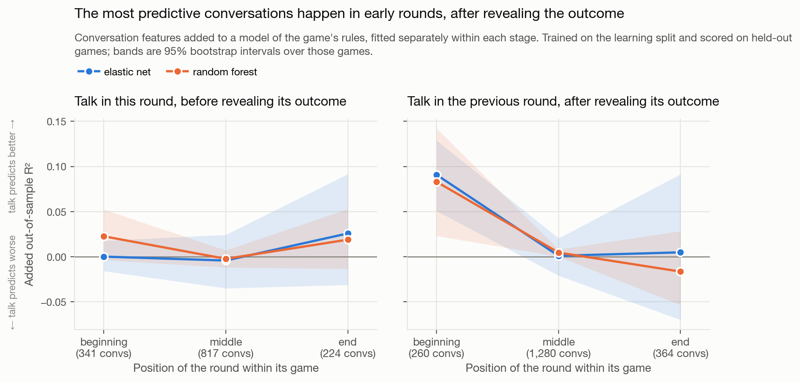
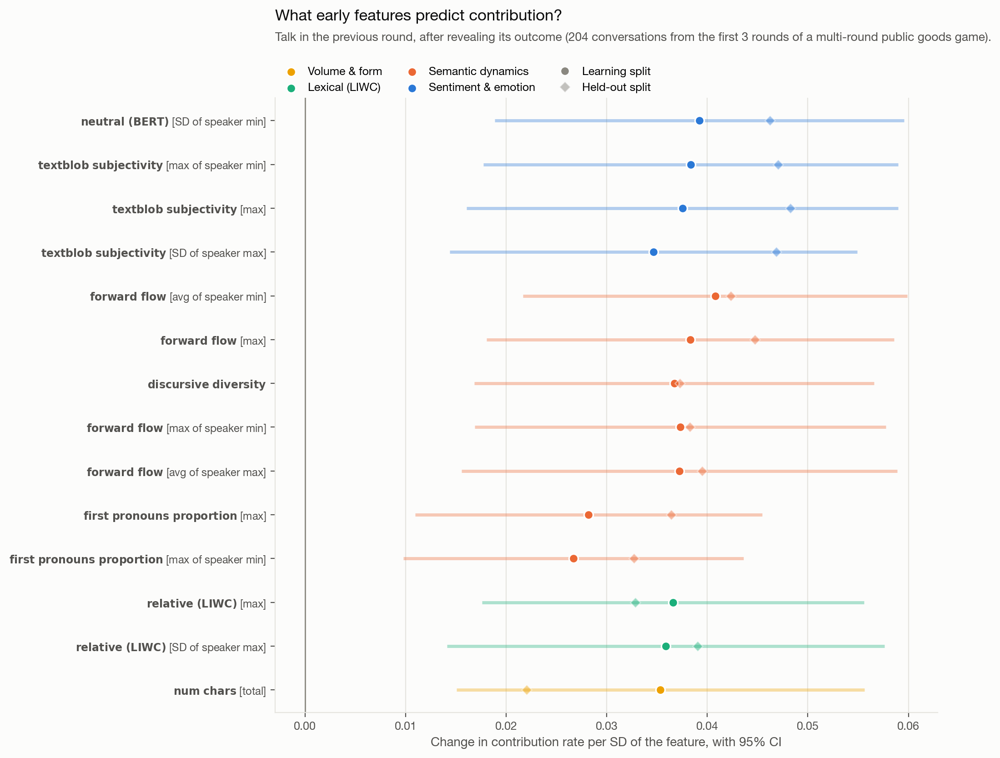
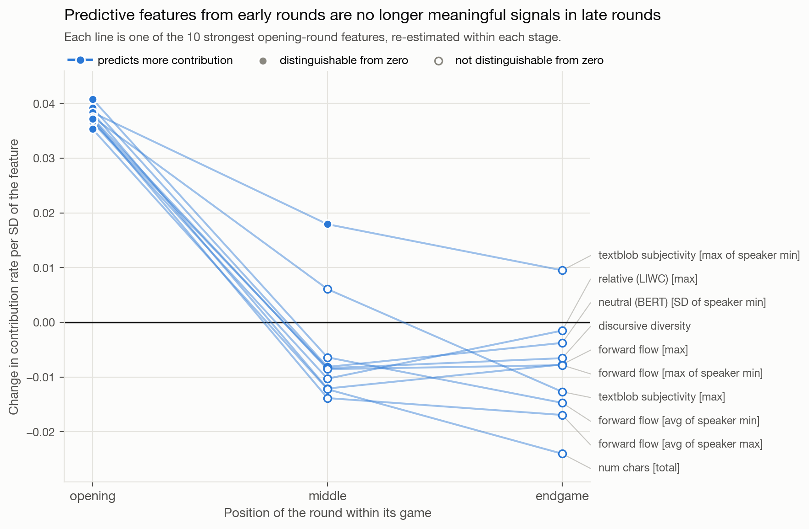

# What do groups say that makes them cooperate?

### A case study for the [Team Communication Toolkit](https://github.com/Watts-Lab/team_comm_tools)

A worked example of using `team_comm_tools` (v0.1.8) end to end: from raw chat
logs, through feature extraction, to a substantive answer about when conversation
predicts behaviour and what kind of conversation does it.

---

## The question

Groups of people play an online **public goods game**. Each round, every player
chooses how much of a private endowment to put into a shared pot; the pot is
multiplied and split evenly regardless of who paid in. Contributing is good for the
group and costly for the individual, so how much a group contributes is a clean
behavioural measure of cooperation. Some groups can chat with each other while they
play.

> **Among rounds where a group talked, what about the conversation predicts how
> much they contribute next?**

The answer, in three parts:

1. Conversation predicts contribution **only in the first three rounds of a game**,
   and only the talk that happens **after a round's outcome is revealed**.
2. In those rounds, a third of the toolkit's features predict contribution, and
   they describe conversations that **cover more ground and carry more opinion**.
3. Those same features **stop predicting** once a game is underway.

---

## Design

**Unit of analysis.** One game-round: a single group, a single round of play. There
are only a few hundred games, but 5,765 game-rounds in the learning split and 6,692
held out, which is what makes the question answerable.

**Outcome.** The group's mean contribution in a round, as a share of the endowment.

**What counts as a conversation.** A round runs in three phases: players choose
during the *contribution* phase, then the result appears in the *outcome* and
*summary* phases. Talk is therefore split by where it sits relative to that reveal,
and both blocks predict the same round's contribution:

| Block | Messages | Learning-split conversations |
|---|---|---|
| **Before the reveal** | that round's contribution phase | 1,162 |
| **After the reveal** | the *previous* round's outcome and summary phases | 1,487 |

Every message is spoken before the decision it is used to predict. The
before-the-reveal block is contemporaneous with that decision rather than strictly
prior to it, but it cannot contain any information about the outcome, which does
not exist yet. The after-the-reveal block carries no such caveat.

Conversations are short: a median of 4 messages for the after-the-reveal block.
A 30-round game contributes close to sixty conversations, not one.

**Where a round sits in its game.** Games run from 3 to 30 rounds, so "early" needs
defining. The main analysis uses round number — beginning is the first three
rounds, end is the last three — and `outputs/figures/archive/staging_comparison.png`
repeats everything using thirds of the game instead.

**Controls.** The game's randomized design parameters (group size, multiplier,
punishment and reward rules) and the round's position in its game.

**Validation.** Feature selection, scaling, model form and hyperparameters are all
decided on the learning split. Held-out games are scored once. Cross-validation
folds hold out whole games, since rounds within a game share a group, a treatment
and often a conversation. Confidence intervals are bootstraps over games.

**Models.** A penalized linear model (`ElasticNetCV`) and a `RandomForestRegressor`,
both with hyperparameters tuned inside each training fold.

---

## Extracting the features

The whole extraction is one call:

```python
from team_comm_tools import FeatureBuilder

FeatureBuilder(
    input_df=chat,                   # one row per message
    conversation_id_col="conv_id",   # one conversation = one game-round-and-block
    speaker_id_col="playerId",
    message_col="text",
    timestamp_col="timestamp",
    custom_features=["(BERT) Mimicry", "Moving Mimicry",
                     "Forward Flow", "Discursive Diversity"],
    drop_redundant_columns=True,     # new in v0.1.8
    corr_thresh=0.9,
    treat_zero_as_na=False,
).featurize()
```

**Redundancy reduction did the feature selection.** The toolkit found 188 groups of
features correlated above 0.9 and kept one representative each, taking **3,083
columns to 252**. The groups are informative in themselves: ConvoKit politeness and
Yeomans receptiveness turn out to measure much the same thing in this data, and
after reduction **not one politeness column survives** — every one was absorbed into
a group represented by a receptiveness or LIWC feature.

A further 17 features were dropped because the held-out split returns no values for
them at all, leaving **151** to analyse. A feature that cannot be estimated out of
sample cannot support a claim that rests on out-of-sample replication.

One setting is deliberately not the default. `treat_zero_as_na=True` is the better
choice for *estimating* correlations between sparse features, but the frame it
modifies is the one written to disk, so it also rewrites every zero in the output as
NA. Here zero is meaningful — a conversation with no greetings really did contain
none — so it is set to `False`.

Features arrive at the conversation level three ways, and the figures name the route
in brackets after each feature:

| Route | Columns | Example |
|---|---|---|
| Native conversation-level | 16 | `discursive_diversity` — computed from the whole conversation |
| Utterance → conversation | 101 | `max_forward_flow` — the largest value across its messages |
| Utterance → speaker → conversation | 135 | `mean_user_min_forward_flow` — each speaker's minimum, then averaged |

---

## 1. Conversation predicts contribution only at the start, and only after the reveal

Conversation features added to a model of the game's rules, fitted separately within
each stage, trained on the learning split and scored on held-out games:

| Stage | Elastic net | Random forest |
|---|---|---|
| **Beginning** (first three rounds) | **+0.091** [0.051, 0.129] | **+0.083** [0.023, 0.142] |
| Middle | +0.001 [−0.021, 0.021] | +0.005 [0.000, 0.008] |
| End (last three rounds) | +0.005 [−0.070, 0.092] | −0.016 [−0.053, 0.028] |

Both model families agree, and both intervals exclude zero at the beginning only.

Talk *before* the reveal predicts nothing at any stage — the left panel of the
figure sits on zero throughout. What matters is what a group says once it has seen
how the round went.



The effect is specific to the literal opening rounds. Grouped into thirds of the
game instead, it disappears: in a 30-round game the first third runs to round 9, and
by then there is nothing to find.

---

## 2. What predicts it

Inside those 204 conversations, **54 of 151 features reach p<0.05** — against about
8 expected by chance — **26 survive a false-discovery-rate correction**, and **23 of
those also hold on held-out data**.



Every surviving effect is positive, and they fall into two ideas:

- **Conversations that cover more ground.** Forward flow, discursive diversity, and
  information diversity all measure how far a conversation travels between messages.
- **Conversations carrying more opinion.** TextBlob subjectivity and the spread of
  BERT sentiment measure how far messages are from flat, neutral statements.

The effects are near-identical in size (0.035 to 0.041 per SD), which is a hint that
they are variations on one underlying signal rather than eight separate findings.
Reading the conversations bears that out.

---

## 3. And they stop predicting once the game is underway

Taking the ten strongest opening-round features and re-estimating each one
separately in the middle and end of a game:

| Stage | Mean coefficient | Significant at p<0.05 |
|---|---|---|
| Beginning | +0.038 | **10 of 10** |
| Middle | −0.006 | 1 of 10 |
| End | −0.009 | **0 of 10** |



They do not reverse — the later coefficients are not distinguishable from zero — they
simply stop carrying information. Across the full set of 151 features, the
correlation between the beginning and the middle of a game is **−0.18**, and between
the beginning and the end **−0.29**. The middle and end resemble each other (+0.48);
neither resembles the beginning.

---

## Reading the conversations behind the features

A feature name describes a construct; it does not tell you what that construct
looked like in the data. `outputs/examples/` holds one plain-text file per reported
feature, with the highest- and lowest-scoring conversations:

```
  round 1 | 3 messages | 2 speakers | feature z = +1.20 | next-round contribution 0.86
      sloth: deducting removes value so we don't wanna do taht either
    gorilla: I came in knowing what I was going to do throughout.
      sloth: Yea, just wanna make sure we are all on same page :) ty gorilla <3
```

```bash
python scripts/06_feature_examples.py --n 15
```

Doing this changes how the result should be read. Across `discursive_diversity`,
`max_forward_flow` and `stdev_user_min_neutral_bert`, the *lowest*-scoring
conversations are the same ones: "Hi / hi", "Yeah! / Yeah!", "ok / ok / Ok". The
highest-scoring are groups coordinating explicitly — proposing an amount, agreeing
to it, naming who did not contribute. These features are substantially detecting
**whether the exchange went beyond pleasantries**, rather than measuring three
distinct constructs.

The same tool exists for the lexicon features, which need it most:

```bash
python scripts/07_lexicon_words.py relative
```

`max_relative_lexical_wordcount` is the second strongest predictor, and the LIWC
"relativity" category sounds specific. In this data it matches *in* (101 times),
*time* (34), *put* (30), *on* (28), *go* (23), *next* (19). A message like "next
round all put 20" scores two; "hi" scores zero. It is another proxy for whether the
message said anything, not a measure of relativity.

---

## What this shows about the toolkit

The extraction is cheap and the grain is a parameter: one `FeatureBuilder` call
turned ~25,000 messages into 151 non-redundant features at a unit — game-round by
position-relative-to-the-reveal — chosen by editing a single argument. The toolkit's
own redundancy reduction then selected features better than a hand-written screen
would, and reported a substantive fact on the way: politeness and receptiveness are
not separate measurements here.

The results are mostly null, and the nulls are informative. A broad screen over 151
features found nothing in the middle or end of a game, nothing in talk before an
outcome is revealed, and one narrow, replicated finding in the opening rounds. That
ratio is normal for an honest exploratory pass, and it is the argument for a tool
that makes such passes cheap.

It is also an argument for reading the text. The strongest features look like
distinct constructs — semantic movement, subjectivity, relativity — and the
conversations show them converging on something simpler: early on, groups that
actually talk to each other go on to contribute more than groups that exchange
greetings. That is a hypothesis worth designing a study around, not a finding to
report as settled.

---

## Repository layout

```
.
├── data/
│   ├── raw/           # the two experiment pickles, as collected
│   └── processed/     # tidy CSVs written by steps 1 and 3
├── scripts/
│   ├── config.py                  # paths, controls, feature families
│   ├── style.py                   # figure conventions and shared styling
│   ├── status.sh                  # pipeline tracker; -w to watch
│   ├── compat/pgg_helper/         # stub module so the raw pickles unpickle
│   ├── 01_prepare_data.py         # pickles      -> chat + game-round tables
│   ├── 02_extract_features.py     # chat table   -> toolkit features
│   ├── 03_build_analysis_table.py # features     -> one row per game-round
│   ├── 04_analysis.py             # every number reported above
│   ├── 05_figures.py              # the three figures
│   ├── 06_feature_examples.py     # conversations behind each feature
│   ├── 07_lexicon_words.py        # which words a lexicon feature counted
│   └── run_all.py                 # steps 1-5, in order
└── outputs/
    ├── features/      # toolkit output at chat, speaker, conversation level
    ├── tables/        # every result as CSV
    ├── examples/      # conversations behind each reported feature
    └── figures/
        └── archive/   # analyses outside this story (see below)
```

## Running it

```bash
pip install -r requirements.txt
python scripts/run_all.py            # end to end
bash scripts/status.sh -w            # watch progress in another terminal
```

Step 2 is the slow one: sentence embeddings and several classifiers over ~25,000
messages, roughly an hour on a laptop CPU, cached afterwards. Step 4 takes about 40
minutes because both model families are retuned inside every cross-validation fold;
`--only` re-runs a single section:

```bash
python scripts/04_analysis.py --only stages     # ~15 min
python scripts/04_analysis.py --only profile    # seconds
python scripts/04_analysis.py --help            # all sections, with costs
```

`scripts/status.sh` reports a stage as current only when its outputs postdate both
the data they were computed from and the script that computed them.

## Also in the repository

Three analyses sit outside the story above. They are computed by `04_analysis.py`,
their tables are in `outputs/tables/`, and their figures in
`outputs/figures/archive/`:

- **The channel effect.** Whether a group had a chat channel at all was randomized.
  Having one raises contribution by 0.143 [0.102, 0.184] — far more than anything
  said in it. That is a fact about the treatment rather than about conversation.
- **Speaking versus saying.** Pooled across all rounds, the apparent effect of talk
  is mostly *whether* a group spoke rather than what it said. The opening-round
  effect above is content: it survives with speech indicators already in the model.
- **Both staging definitions.** The stage analysis repeated using thirds of the game
  rather than round number.

## A note on interpretation

These features are **exploratory signals, not validated constructs**. The toolkit
guarantees that each column computes what its documentation says; it cannot
guarantee that a column measures the construct a reader has in mind — as the
`relative` example above shows. Screen broadly, control for what you know, check
against held-out data, and read the text before believing a feature name.
