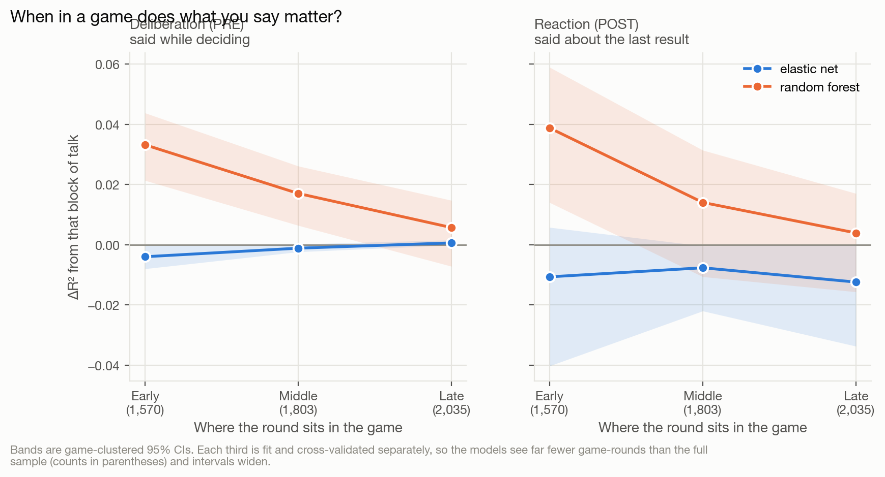
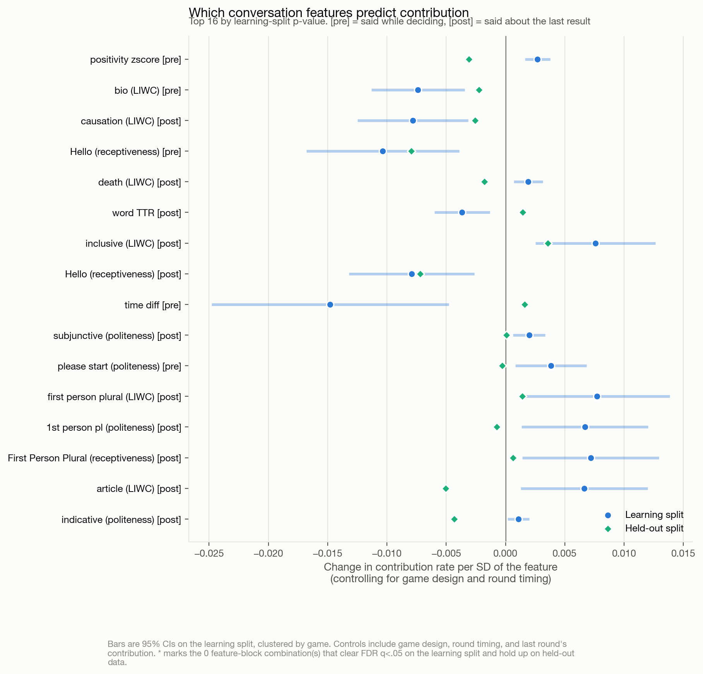

# What do groups say that makes them cooperate?

### A case study for the [Team Communication Toolkit](https://github.com/Watts-Lab/team_comm_tools)

This repository is a worked example of using the Team Communication Toolkit
(`team_comm_tools`, v0.1.8) end to end: from raw conversation logs, to 100+
extracted conversation features, to an answer to a substantive research question.

It is deliberately small. The point is not the sophistication of the analysis but
the shape of the workflow — how little work it takes to get from a four-column
chat table to a set of plausible signals worth testing.

---

## The research question

> **Which conversation features predict greater contribution in groups that
> communicate, versus groups that do not?**

The setting is an online **public goods game**. Groups of players repeatedly choose
how much of a private endowment to put into a shared pot; the pot is multiplied and
split evenly regardless of who paid in. Contributing is good for the group and
costly for the individual, so contribution rates are a clean behavioral measure of
cooperation.

Crucially, the experiment randomized **whether a group had a chat channel at all**,
alongside every other rule of the game. That turns a vague question into a variance
decomposition with three terms:

| Term | What it is | How much of the story? |
|---|---|---|
| **Rules & timing** | group size, multiplier, punishment and reward rules, how far into the game the round sits | the floor any conversation feature has to clear |
| **Channel** | whether the group could talk at all | the "mere access" effect the literature reports |
| **Content** | 136 toolkit features describing what was actually said | the part the Team Communication Toolkit exists to measure |

Groups without a channel are not a nuisance category to drop — they are the
counterfactual that separates the second term from the third.

## Design

* **Unit of analysis:** a **game-round** — one group, one round of play. There are
  only a few hundred games but several thousand game-rounds, and that is what makes
  the question answerable.
* **Outcome:** the group's mean contribution rate in a round, as a share of endowment.
* **Prediction runs forward in time:** a round's conversation predicts the *next*
  round's contribution.

  ```
  talk during round k   ->   contribution in round k+1
  ```

  Round *k*'s chat spans its contribution, outcome, and summary phases, so it
  includes the group reacting to how the round turned out. Using it to predict
  round *k+1* keeps every message strictly earlier than the decision it predicts.
* **Controls:** the randomized design parameters plus round timing (how far into
  the game, how many rounds remain). Groups defect predictably as the end
  approaches; a model without timing would credit that to whatever was being said.
* **No-chat rounds keep neutral feature values.** Rounds with no channel have no
  conversation to describe, so their conversation features are set to the mean of
  the rounds that did have one — zero, since features are z-scored on the learning
  split's conversing rounds. This is not cosmetic:
  * for the linear model it is a reparameterization, so the fit is identical to
    zero-filling, but the channel coefficient now reads as *the effect of having a
    channel holding the conversation at a typical one*, rather than relative to a
    conversation scoring zero on 136 features at once;
  * for the random forest it changes the fit. Zero-filling would park every no-chat
    round at the extreme edge of every feature, letting the trees identify them from
    any column and dissolving the channel/content distinction.
* **Games are held out whole.** Rounds within a game share a group, a treatment, and
  often a conversation, so cross-validation folds split on `gameId` and every
  confidence interval comes from a game-clustered bootstrap. Row-wise folds would
  be predicting a game partly from itself.
* **Two model families:** a penalized linear model (`ElasticNetCV`) and a
  `RandomForestRegressor`, run side by side throughout. Where they disagree, the
  disagreement is the finding.
* **Validation:** every modeling decision — which features survive screening, the
  z-scoring moments, model form, hyperparameters — is made on the **learning split**
  alone. The **held-out split** is scored once, at the end.

## Repository layout

```
.
├── data/
│   ├── raw/           # the two experiment pickles, as collected
│   └── processed/     # tidy CSVs written by step 1 and step 3
├── scripts/
│   ├── config.py                 # paths and constants, imported everywhere
│   ├── style.py                  # shared figure styling
│   ├── compat/pgg_helper/        # stub module so the raw pickles unpickle
│   ├── 01_prepare_data.py        # raw pickles  -> chat + game-round tables
│   ├── 02_extract_features.py    # chat table   -> toolkit features
│   ├── 03_build_analysis_table.py# features     -> one row per game-round
│   ├── 04_analysis.py            # decomposition, families, timing, features
│   ├── 05_figures.py             # the five figures
│   └── run_all.py                # all of the above, in order
└── outputs/
    ├── features/      # toolkit output at chat, speaker, conversation level
    ├── tables/        # analysis results as CSV
    └── figures/       # the figures reported below
```

## Running it

```bash
pip install -r requirements.txt
python scripts/run_all.py
```

Step 2 is the slow one: it runs sentence embeddings and several classifiers over
~23,000 messages, and takes on the order of an hour on a laptop CPU. Its outputs are
cached, so re-running it is a no-op unless you pass `--force`. Step 4 takes a few
minutes (the penalized models are refit inside every cross-validation fold, three
times over). Every script also runs standalone.

## Using the toolkit

The entire feature-extraction step is one call. This is the part worth copying:

```python
from team_comm_tools import FeatureBuilder

FeatureBuilder(
    input_df=chat,                 # one row per message
    conversation_id_col="conv_id",  # one conversation == one game-round
    speaker_id_col="playerId",
    message_col="text",
    timestamp_col="timestamp",
    output_file_path_chat_level="outputs/features/learn_chat_level.csv",
    output_file_path_user_level="outputs/features/learn_user_level.csv",
    output_file_path_conv_level="outputs/features/learn_conv_level.csv",
    custom_features=["(BERT) Mimicry", "Moving Mimicry",
                     "Forward Flow", "Discursive Diversity"],
).featurize()
```

Four columns in; three levels of analysis out. The conversation-level file is the
one this case study models, since the question is about what a group said in a
round rather than about individual messages.

## Findings

_Every number below is produced by `scripts/04_analysis.py`; full tables are in
`outputs/tables/`. Track a run with `bash scripts/status.sh -w`._

### A. Groups that can talk contribute more

| Split | No channel | Channel open | Adjusted difference | p |
|---|---|---|---|---|
| Learning (5,408 game-rounds, 357 games) | 0.681 | 0.824 | **+0.152** [0.109, 0.195] | <.001 |
| Held-out (6,246 game-rounds, 446 games) | 0.704 | 0.805 | **+0.069** [−0.005, 0.142] | .068 |

Errors clustered by game. The effect replicates in direction but is roughly half the
size and only marginally significant in the held-out split — worth stating plainly
rather than averaging away.


### B. The decomposition: momentum, then channel, then almost nothing

Cross-validated ΔR², games held out whole, game-clustered bootstrap CIs:

| Step | Elastic net | Random forest |
|---|---|---|
| Having a channel | **+0.103** [0.044, 0.158] | **+0.069** [0.033, 0.108] |
| What they contributed last round | **+0.581** [0.509, 0.655] | **+0.467** [0.415, 0.523] |
| Deliberation (PRE) | −0.000 [−0.001, 0.000] | +0.005 [−0.003, 0.011] |
| Reaction (POST) | −0.001 [−0.001, 0.000] | +0.003 [−0.017, 0.014] |
| Both blocks | −0.001 [−0.002, 0.000] | +0.003 [−0.016, 0.015] |

Full models reach R² 0.77 (elastic net) and 0.67 (forest), from a base of 0.08 / 0.14
on the game's rules alone. **Contribution is overwhelmingly predicted by what the
group did last round** (r = 0.87 round to round). Having a channel is worth a real
but far smaller amount. What was actually said adds nothing either model can detect.


**The ordering of the first two steps is a substantive decision, not housekeeping.**
Momentum is the strongest single predictor, so the tempting move is to control for it
first and ask what survives. That is wrong for the channel: the channel was randomized
at the *game* level and raises contribution in every round, so last round's
contribution is a **mediator** of the channel effect, not a confounder. Entering it
first blocks the channel's own causal pathway — doing so shrinks the channel from
+0.103 to +0.004, which is an artifact of over-controlling. The channel therefore goes
first (it was randomized and needs no adjustment); momentum follows; and the talk
blocks are judged against that much tougher baseline, which *is* the right test for
them, since POST-block talk reacts to the very number momentum encodes.

### C. No feature family carries unique signal

Dropping each toolkit family from the full model changes R² by less than 0.001 under
the elastic net and by a negative amount under the forest — removing a family
sometimes *helps*. The families are highly redundant with each other, and what little
they capture is already carried by whether a channel existed at all.


### D. The one place a content effect survives

Recomputing each block's ΔR² within thirds of a game, the two model families disagree:

| Stage | Elastic net (PRE / POST) | Random forest (PRE / POST) |
|---|---|---|
| Early | −0.004 / −0.011 | **+0.033** [0.021, 0.044] / **+0.039** [0.014, 0.059] |
| Middle | −0.001 / −0.008 | +0.017 [0.006, 0.026] / +0.014 [−0.011, 0.031] |
| Late | +0.001 / −0.012 | +0.006 [−0.007, 0.015] / +0.004 [−0.016, 0.017] |

The forest finds talk carrying real variance **early** in a game and decaying to
nothing by the end — a plausible story about norm-setting, and the one result here
pointing at a content effect. The elastic net finds nothing anywhere. When a
nonlinear model sees signal a linear one cannot, the usual explanation is
interactions the linear model has no way to represent; with the two families
disagreeing this is a lead, not a result.



### E. Controlling for momentum dissolves the feature-level findings

| | Without momentum control | With momentum control |
|---|---|---|
| Features clearing FDR q<.05 on learn | 13 | **2** |
| …also holding up on the held-out split | 7 | **0** |

279 feature-block combinations were tested. In the earlier specification, positive-emotion
receptiveness, positive politeness, LIWC positive words and BERT positivity all looked
like robust positive predictors that replicated out of sample. Once last round's
contribution is controlled, they vanish. They were substantially encoding *"this group
was already contributing a lot"* rather than adding independent signal.



### What the case study demonstrates about the toolkit

Two things, and the second is the more useful one.

The workflow is cheap: **one `FeatureBuilder` call** turned ~23,000 raw messages into
140 features per talk block, at a grain (game-round × pre/post) chosen after the fact
by changing a single `conversation_id_col`. That is the toolkit working as intended.

The results are mostly null, and the nulls are the point. A broad, cheap screen over
140 features found: no family carrying unique variance, no feature surviving both an
FDR correction and a held-out test, and a content term indistinguishable from zero
under two model families. Getting there required three corrections that each changed
the answer — clustering folds by game, entering the channel before its own mediator,
and controlling for momentum at all. **A toolkit that makes features cheap does not
make the study design cheap**, and the failure modes here were all design failures
that cheap features made easy to walk into.

## A note on what this does and does not show

These features are **exploratory signals, not validated constructs**. The toolkit
guarantees that each column computes what its documentation says it computes; it
cannot guarantee that a column measures the construct a given researcher has in
mind. The workflow here — screen broadly, control for what you know, then check
against held-out data — is the appropriate way to treat that kind of output. A
feature that survives it is a hypothesis worth following up, not a finding.
