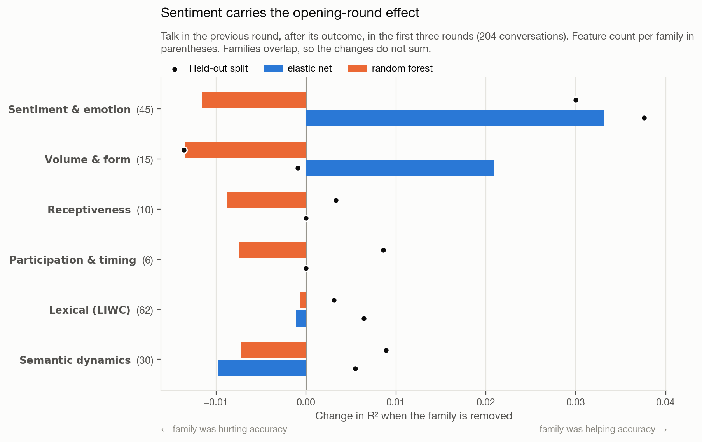
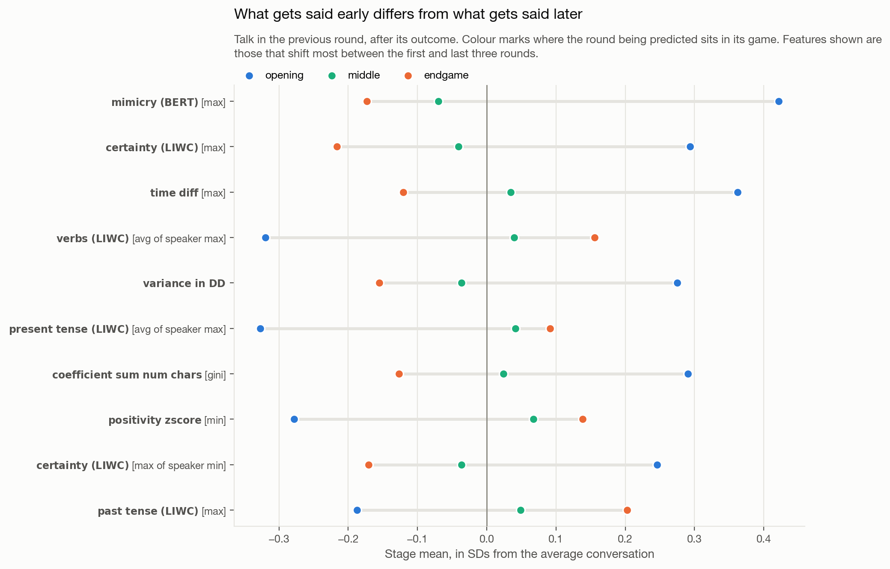
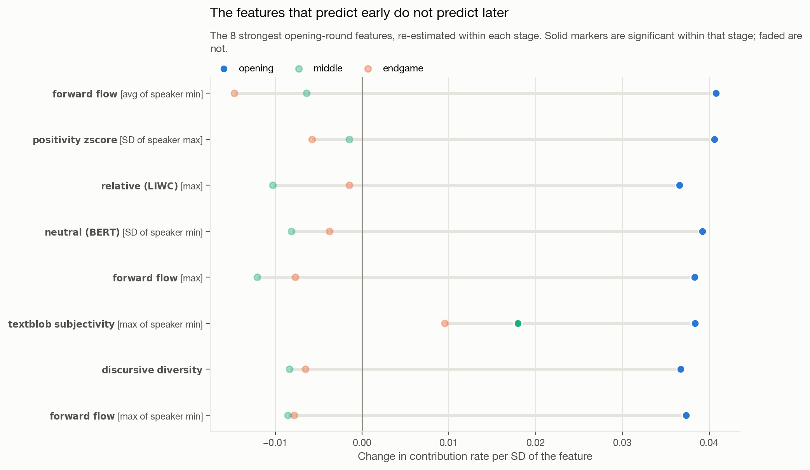

# What do groups say that makes them cooperate?

### A case study for the [Team Communication Toolkit](https://github.com/Watts-Lab/team_comm_tools)

This repository is a worked example of using the Team Communication Toolkit
(`team_comm_tools`, v0.1.8) end to end: from raw conversation logs, to 100+
extracted conversation features, to an answer to a substantive research question.

It is deliberately small. The point is not the sophistication of the analysis but
the shape of the workflow — how little work it takes to get from a four-column
chat table to a set of plausible signals worth testing.

---

## The research question

> **Among rounds where a group talked, what about the conversation predicts how much
> they contribute next?**

The setting is an online **public goods game**. Groups repeatedly choose how much of
a private endowment to put into a shared pot; the pot is multiplied and split evenly
regardless of who paid in. Contributing is good for the group and costly for the
individual, so contribution rate is a clean behavioral measure of cooperation.

The short answer: **what a group says right after seeing an early result predicts
what it does next, and nothing else about the conversation does.** The rest of this
README unpacks that.

## Design

* **Unit of analysis:** a **game-round** — one group, one round of play. 5,765 in the
  learning split, 6,692 held out.
* **Outcome:** the group's mean contribution in a round, as a share of endowment.
* **Predictor:** the conversation in the **previous round, after its outcome was
  revealed** — that round's outcome and summary phases. Every message is therefore
  spoken before the decision it predicts.
* **Controls:** the game's randomized design parameters and the round's position in
  the game.
* **Where the round sits in its game**, defined two ways, because games run from 3 to
  30 rounds and the definitions disagree:

  | Scheme | Definition |
  |---|---|
  | **By round number** (primary) | beginning = first three rounds, end = last three |
  | **By thirds** | beginning, middle and end are each one third of the rounds played |

* **Games are held out whole.** Rounds within a game share a group, a treatment and
  often a conversation, so cross-validation folds split on `gameId` and every
  interval comes from a game-clustered bootstrap.
* **Two model families**, hyperparameters retuned inside each training fold:
  `ElasticNetCV` and a `RandomForestRegressor`.
* **Validation:** feature selection, scaling and model form are decided on the
  learning split. The held-out split is scored once.

## What counts as a conversation, and how features are aggregated

The toolkit computes each feature **at the utterance level** — one value per
message — and then aggregates upward. What "upward" means depends on what you tell
it a conversation is, so that choice does most of the work.

**Here, one conversation is one game-round *and* one block.** A conversation id is
`{gameId}_r{round}_{pre|post}`, so a single game contributes many conversations
rather than one:

| | Learning split |
|---|---|
| Games that talked | 148 |
| Conversations | 2,649 |
| Conversations per game | median 14, max 56 |
| Messages per conversation | median 3 |

A 30-round game yields close to sixty conversations, not thirty: up to one
before-outcome conversation per round, plus one after-outcome conversation per round
that has a successor. This is why the conversations are short — a median of three
messages — and why conversation-level features like discursive diversity are noisier
here than they would be over a whole game.

Which messages land in which conversation:

| Block | Messages | Predicts |
|---|---|---|
| `{game}_r{t}_pre` | round *t*'s contribution-phase chat | round *t*'s contribution |
| `{game}_r{t}_post` | round *t*'s outcome- and summary-phase chat | round *t+1*'s contribution |

So round *t*'s messages are split across two different conversations depending on
whether they were sent before or after that round's result appeared, and those two
conversations are featurized independently and predict different rounds. Nothing is
double-counted, and nothing is discarded except messages with no round to predict:
round 0's pre-outcome chat (there is no round before it to supply a POST block, and
the analysis needs both) and the final round's post-outcome chat.

The 248 surviving columns reach the conversation level three different ways:

| Route | Columns | Example |
|---|---|---|
| **Native conversation-level** | 16 | `turn_taking_index`, `team_burstiness`, `discursive_diversity` — computed from the conversation as a whole, never aggregated from parts |
| **Utterance → conversation** | 91 | `max_forward_flow` — the largest value across the messages in the conversation |
| **Utterance → speaker → conversation** | 137 | `mean_user_max_positivity_zscore_chats` — each speaker's maximum across their own messages, then averaged across speakers |

The two-stage columns are the ones with awkward names, and the extra stage matters:
`mean_user_max_X` and `max_X` answer different questions — "how high does a typical
participant get" versus "how high does anyone get" — and a three-person conversation
can move them in opposite directions. Figures spell the route out in brackets after
the feature name, so `certainty (LIWC) [max of speaker min]` reads as the
conversation maximum, across speakers, of each speaker's minimum.

## How the nested models are built

Each ΔR² in the decomposition is the gain from adding one block of columns to a
model that already contains everything above it *in its own group*:

```
M0   game rules + round timing
M1   M0 + chat channel indicator                    -> ΔR² for the channel

     within the before-outcome block:
M2a  M1 + did this group speak this round           -> ΔR² for speaking
M3a  M2a + 168 features describing what was said    -> ΔR² for content

     within the after-outcome block:
M2b  M1 + did this group speak last round           -> ΔR² for speaking
M3b  M2b + 168 features describing what was said    -> ΔR² for content
```

The two talk blocks branch from the same point (M1) rather than chaining into each
other, so neither gets an advantage from being entered first. Content is always
measured *after* the speech indicators, which is what makes "what was said" mean
what it says: any gain it shows is over and above knowing whether the group spoke.

Every R² is out-of-fold, from 10-fold cross-validation with whole games held out, and
every interval is a 95% percentile bootstrap resampling games rather than rows.
Model hyperparameters are retuned inside each training fold.

## Feature extraction

The toolkit's own redundancy reduction does the feature selection, new in v0.1.8:

```python
FeatureBuilder(
    input_df=chat,
    conversation_id_col="conv_id",   # one conversation = one game-round-and-block
    speaker_id_col="playerId",
    message_col="text",
    timestamp_col="timestamp",
    custom_features=["(BERT) Mimicry", "Moving Mimicry",
                     "Forward Flow", "Discursive Diversity"],
    drop_redundant_columns=True,
    corr_thresh=0.9,
    treat_zero_as_na=False,
).featurize()
```

That took **3,083 columns to 248**, by finding 188 groups of features correlated
above 0.9 and keeping one representative each. The groups are informative in their
own right — ConvoKit politeness and Yeomans receptiveness measure much the same
thing here, and after reduction **not one politeness column survives**; every one was
absorbed into a group represented by a receptiveness or LIWC feature. Receptiveness
itself fell from 34 columns to 9.

One setting is deliberately not the default. `treat_zero_as_na=True` is better for
*estimating* correlations between sparse features, but the frame it modifies is the
one written to disk, so it also rewrites every zero in the output as NA — on a
60-conversation sample, 7,642 zeros became 20,745 NAs. Here zero is data ("this
conversation contained no greetings"), and the analysis reads NA as "no conversation
happened".

## Repository layout

```
.
├── data/
│   ├── raw/           # the two experiment pickles, as collected
│   └── processed/     # tidy CSVs written by steps 1 and 3
├── scripts/
│   ├── config.py                  # paths, controls, feature families
│   ├── style.py                   # figure rules and shared styling
│   ├── status.sh                  # pipeline tracker; -w to watch
│   ├── compat/pgg_helper/         # stub module so the raw pickles unpickle
│   ├── 01_prepare_data.py         # pickles      -> chat + game-round tables
│   ├── 02_extract_features.py     # chat table   -> toolkit features
│   ├── 03_build_analysis_table.py # features     -> one row per game-round
│   ├── 04_analysis.py             # every result reported below
│   ├── 05_figures.py              # the eight figures
│   └── run_all.py                 # all of the above, in order
└── outputs/
    ├── features/      # toolkit output at chat, speaker, conversation level
    ├── tables/        # analysis results as CSV
    └── figures/       # the figures reported below
```

## Running it

```bash
pip install -r requirements.txt
python scripts/run_all.py          # end to end
bash scripts/status.sh -w          # watch progress in another terminal
```

Step 2 is the slow one: sentence embeddings and several classifiers over ~23,000
messages, on the order of an hour on a laptop CPU. Its outputs are cached, so
re-running is a no-op unless you pass `--force`. Step 4 takes roughly 20 minutes,
since both model families are retuned inside every cross-validation fold. Every
script also runs standalone.

`scripts/status.sh` reports a stage as current only when its outputs postdate both
the data they were computed from *and* the script that computed them, and prints a
red `!` otherwise. That is worth having: several results in earlier drafts of this
analysis were read off tables that a later change had already invalidated.

## Findings

_Every number comes from `scripts/04_analysis.py`; full tables are in
`outputs/tables/`. Track a run with `bash scripts/status.sh -w`._

### 1. Talk predicts contribution only at the very start of a game

Restricted to rounds that actually had a conversation, and added to a model of the
game's rules:

| Position of the round | Elastic net ΔR² (held out) | Random forest ΔR² (held out) |
|---|---|---|
| **First three rounds** | **+0.076** [0.016, 0.134] (**+0.069**) | +0.057 [−0.045, 0.149] (**+0.079**) |
| Middle | +0.045 (+0.001) | +0.022 (+0.001) |
| Last three rounds | −0.011 (+0.003) | −0.008 (−0.014) |

Both model families agree, and both replicate out of sample.

The effect also **depends on how a game stage is defined**. Grouped into thirds of
the game rather than by round number, the same analysis returns +0.014 and −0.012.
It belongs to the literal opening rounds, not to the first third of a game — in a
30-round game the first third runs to round 9, and by then there is nothing.


### 2. What predicts it

Inside those 204 conversations, **67 of 168 features reach p<0.05** — against about 8
expected by chance — and **28 survive FDR correction**, of which **23 also replicate**
on the held-out split.


Every surviving effect is positive, and they group into two ideas: conversations
that **move across more ground** (forward flow, discursive diversity, info
diversity) and conversations that are **more subjective and positive** (positivity
z-score, textblob subjectivity, neutral BERT inverted).

### 3. Sentiment carries it

Dropping each toolkit family in turn from a model of these 204 conversations:

| Family | CV ΔR² | Held-out ΔR² |
|---|---|---|
| **Sentiment & emotion** (45 features) | **+0.033** | **+0.038** |
| Volume & form (15) | +0.021 | −0.001 |
| Lexical, semantic dynamics, receptiveness, participation | ≤0 | ≈0 |

Only sentiment carries variance that nothing else in the toolkit recovers, and it is
the only family whose contribution holds on held-out data. Note that this is the same
analysis run across *all* rounds returns nothing at all for every family — the effect
is invisible unless you look where it lives.



### 4. Opening talk is different talk

The conversations themselves differ, not just their predictive value. Compared with
the average conversation in the dataset, talk after an opening round runs high on
mimicry and certainty language and low on subjectivity, while later rounds sit flat
on all of it.



Sampled messages show what the features are picking up. Opening talk is explicit
coordination on a number:

> "Okay, 20 it is." · "yeah i agree, the multiplier is so big" · "If we all do, yes."

Later talk is acknowledgement and chatter:

> "yes" · "max" · "it varies i think" · "It's cool lol"

### 5. And the same features stop working

Taking the eight strongest opening-round features and re-estimating each one
separately in the middle and end of a game: every one of them collapses to zero or
crosses into negative, and none is significant outside the opening.



Across the full coefficient vectors, the correlation between the opening and the
middle of a game is **−0.23**, and between the opening and the end **−0.34**. The
middle and end resemble each other (+0.53); neither resembles the opening. Whatever
conversation is doing in the first three rounds, it is not doing it later.

### What this demonstrates about the toolkit

One `FeatureBuilder` call turned ~25,000 messages into 168 non-redundant features, at
a grain chosen after the fact by changing one argument. The toolkit's own redundancy
reduction (`drop_redundant_columns=True`) cut 3,083 columns to 248 and reported which
constructs were duplicates — in this dataset ConvoKit politeness is entirely absorbed
by Yeomans receptiveness and LIWC, and not one politeness column survives.

The result is one narrow, replicated finding surrounded by nulls. That ratio is
normal for an honest exploratory pass, and it is the reason a tool that makes such
passes cheap is worth having. It is also why the finding needed to be located rather
than averaged: pooled across all rounds, every family returns nothing.

## What is not in this case study

Two analyses were run and then set aside because they answer a different question
than the one above. Both are still computed by `scripts/04_analysis.py`, and their
tables and figures are in `outputs/tables/` and `outputs/figures/archive/`:

* **The channel effect.** Whether a group had a chat channel at all was randomized,
  and having one raises contribution by 0.143 [0.102, 0.184] — five to ten times any
  effect of what was said. That is a finding about the treatment, not about
  conversation, and it dwarfs the story above without illuminating it.
* **Speaking versus saying.** Splitting the talk terms into "did the group speak at
  all" and "what did it say" shows the pooled talk effect is mostly the former.
  That matters for interpreting the pooled numbers, but the opening-round effect in
  section 2 is content: it survives with the speech indicators already in the model.

## A note on what this does and does not show

These features are **exploratory signals, not validated constructs**. The toolkit
guarantees that each column computes what its documentation says it computes; it
cannot guarantee that a column measures the construct a given researcher has in
mind. The workflow here — screen broadly, control for what you know, then check
against held-out data — is the appropriate way to treat that kind of output. A
feature that survives it is a hypothesis worth following up, not a finding.
